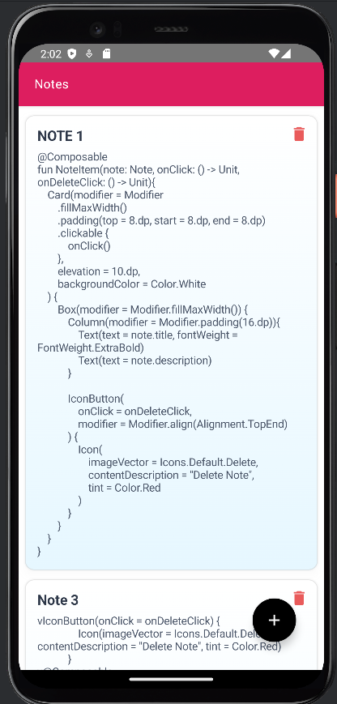
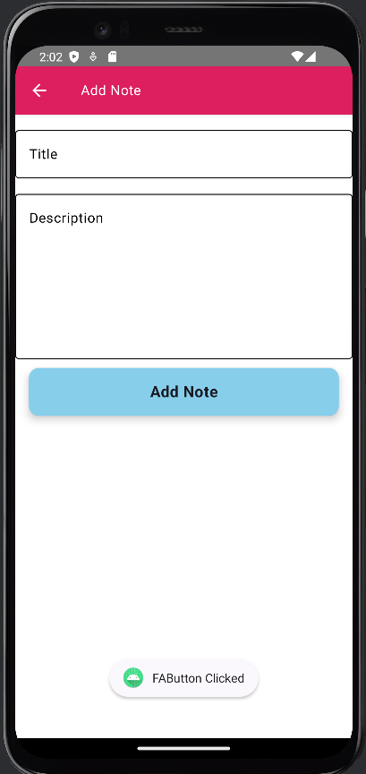
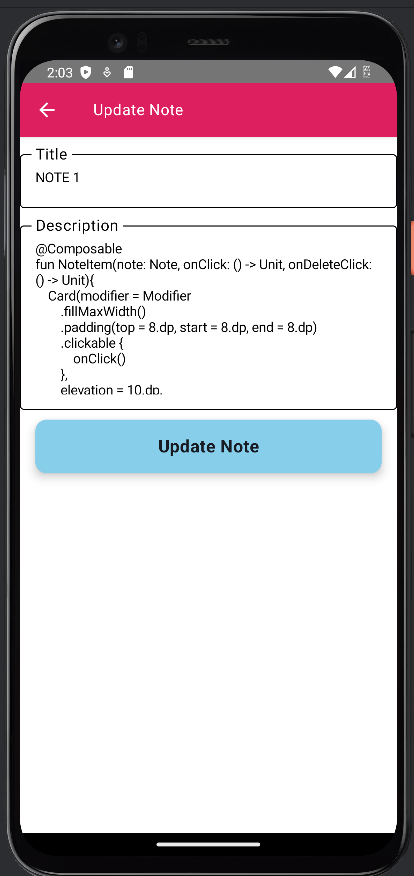

# Notes App with CRUD Operations (Room Database, ViewModel, RecyclerView)

## Overview
This is a simple yet powerful **Notes App** built using **Kotlin**, implementing **MVVM architecture** with **Room Database** for local data storage. It allows users to perform **CRUD (Create, Read, Update, Delete) operations** efficiently. The app features a modern UI with RecyclerView for seamless note management.

## Features
- **Create Notes**: Add new notes with a title and description.
- **Read Notes**: View saved notes in a list format.
- **Update Notes**: Edit existing notes to modify content.
- **Delete Notes**: Remove notes when no longer needed.
- **ViewModel Implementation**: Ensures data persistence and lifecycle awareness.
- **LiveData Integration**: Automatically updates UI when data changes.
- **RecyclerView for UI**: Displays notes in an efficient list format.

## Tech Stack
- **Kotlin**: Primary programming language.
- **MVVM Architecture**: Ensures a clean separation of concerns.
- **Room Database**: Provides an abstraction layer over SQLite.
- **ViewModel**: Manages UI-related data in a lifecycle-conscious way.
- **LiveData**: Updates UI whenever data changes.
- **RecyclerView**: Displays the list of notes efficiently.

## Screenshots

